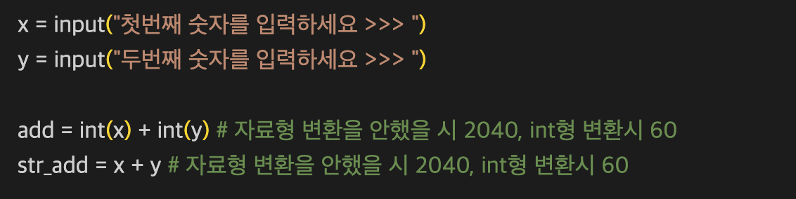
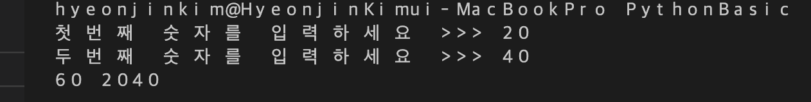

# 입력과 자료형 변환

## 사용자로부터 입력을 받는 명령어
### 데이터 입력받기
- input(): 입력함수
- 사용자로부터 입력을 받는 함수
    - x = input()
    - (1) 할당연산자 오른쪽부터 실행
    - (2) input 함수 실행시, 입력 기다림
    - (3) 입력하고 에터치면 input 함수 자리에 데이터가 들어가고 변수에 저장됨.
    - x = input("입력하세요 >>> ") 옆에 인풋 데이터를 넣을 수 있음.
## 자료형 변환을 하는 이유와 방법

  

결과

